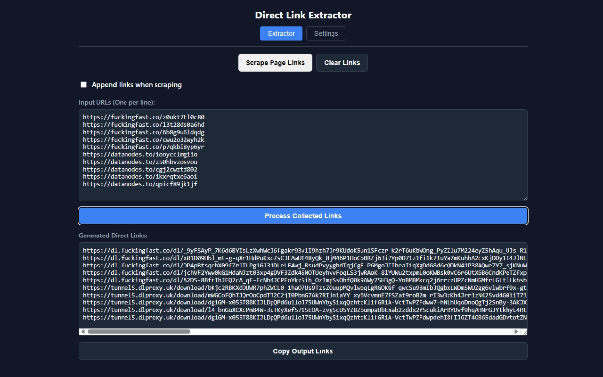

# [Direct Link Extractor](https://github.com/AkshayBhanawala/BrowserExtention.DirectLinkExtractor)


A powerful, cross-browser Manifest V3 extension designed to bypass intermediate pages and extract direct download links for **[fuckingfast.co](https://fuckingfast.co)** and **[datanodes.to](https://datanodes.to)**.

Built with pure vanilla JavaScript, it features a robust background-processing engine to handle cross-origin requests, a page scraper, and a fully customizable API payload configuration.



## ✨ Features

* **Dual-Mode Processing:**
	* **Batch Extraction:** Paste multiple links or scrape an entire webpage to process them all at once.
	* **Direct Page Integration:** Navigate directly to a target URL, click "GET DIRECT LINK", and watch the page layout transform into a clean, single-click download button.
* **Smart Page Scraping:** Instantly scan any website for supported anchor tags and append them to your queue.
* **100% Cross-Browser Compatible:** Uses unified Promise-based APIs ensuring seamless execution on both Google Chrome and Mozilla Firefox.
* **Configurable API Engine:** File hosts change their APIs frequently. The built-in JSON configuration editor allows you to update headers, referers, and form data payloads on the fly without touching the source code.
* **Data Persistence:** Automatically saves your input queues, output results, and settings locally.
* **Dark Theme:** Native dark mode support for the popup UI.
* **Portable Settings:** Export your custom API configurations to a `.json` file and import them on other machines.

---
## [Chrome Web Store](https://chromewebstore.google.com/detail/direct-link-extractor/dggijedklkagcmcocaephhbflpplfmlo)
[](https://chromewebstore.google.com/detail/direct-link-extractor/dggijedklkagcmcocaephhbflpplfmlo)

## [Firefox Add-ons](https://addons.mozilla.org/en-US/firefox/addon/direct-link-extractor)
[](https://addons.mozilla.org/en-US/firefox/addon/direct-link-extractor)
---

## 🚀 Installation (Developer Mode - In case the extension store links are not working)

If above provided extension store links are not working, then you will need to load it manually as an unpacked extension. \
To get the extension, you can either clone or download this repository; or go to [releases](https://github.com/AkshayBhanawala/BrowserExtention.DirectLinkExtractor/releases) and download the latest version zip file.

### [For Google Chrome, Brave, Edge, other chromium based browsers](https://google.com/search?q=Adding+extension+zip+in+chrome):
1. Open your browser and navigate to `chrome://extensions/` (or `edge://extensions/`).
2. Toggle **Developer mode** ON (usually located in the top-right corner).
3. Click the **Load unpacked** button.
4. Select the folder containing this extension's source code - folder containing the `manifest.json` file.
5. Pin the extension to your toolbar for easy access!


### [For Mozilla Firefox](https://google.com/search?q=Adding+extension+zip+in+Firefox):
1. Open Firefox and navigate to `about:debugging#/runtime/this-firefox`.
2. Click the **Load Temporary Add-on...** button.
3. Navigate to the extension folder and select the `manifest.json` file.
4. *Note: Firefox removes temporary add-ons when the browser closes. To make it permanent, you must zip the files and sign the add-on via the Mozilla Developer Hub.*

---

## 🛠️ How to Use

### 1. Batch Link Processing
* Click the extension icon to open the popup.
* Paste your target links into the **Input URLs** box (one per line).
* *Alternatively:* Click **Scrape Page Links** to automatically pull all supported URLs from the webpage you are currently viewing.
* Click **Process Collected Links**.
* Wait a little while until the processing completes in the background. Processing time is proportional with the number of links.
* The extension will securely communicate with the file hosts in the background and output the direct download URLs in the bottom text area. Click **Copy Output Links** to grab them.

### 2. Direct Page Bypass
* Navigate to any file page on `fuckingfast.co` or `datanodes.to`.
* Click the extension icon. The UI will adapt automatically.
* Click **GET DIRECT LINK**.
* The extension will communicate with the host, wipe out the site's ads and timers, and replace the page with a massive, centered **Download Now** button.

---

## ⚙️ Advanced Configuration Engine

If `fuckingfast.co` or `datanodes.to` update their backend logic (e.g., adding a new required form field or header), you can fix the extension directly from the UI without rewriting the JavaScript.

1. Open the extension and click the **Settings** tab.
2. Edit the **Raw Engine Configuration (JSON Editor)**.

**Default Configuration:**
```json
{
	"fuckingfast": {
		"targetUrl": "https://fuckingfast.co/f/{id}/go",
		"headers": {
			"cache-control": "no-cache",
			"hx-request": "true",
			"pragma": "no-cache"
		}
	},
	"datanodes": {
		"targetUrl": "https://datanodes.to/download",
		"formData": {
			"op": "download2",
			"referer": "https://datanodes.to/download",
			"method_free": "",
			"method_premium": "Premium Download >>",
			"g_captch__a": "1"
		}
	}
}
```

#FitGirl
#FitGirl-Repacks
#FitGirl-Repacks.Site